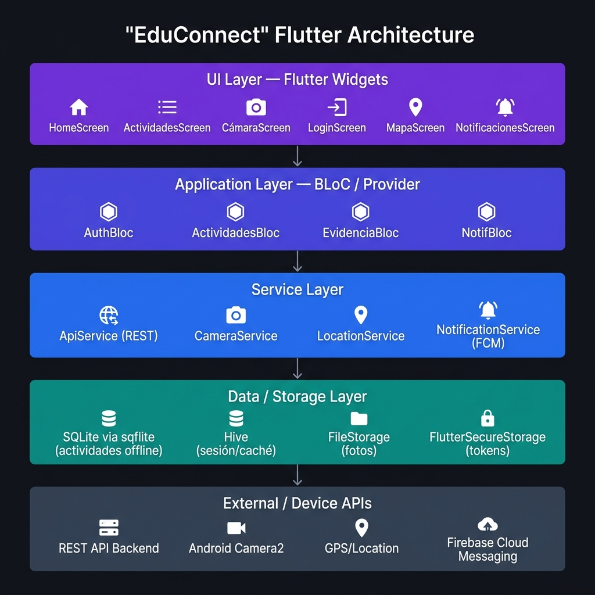
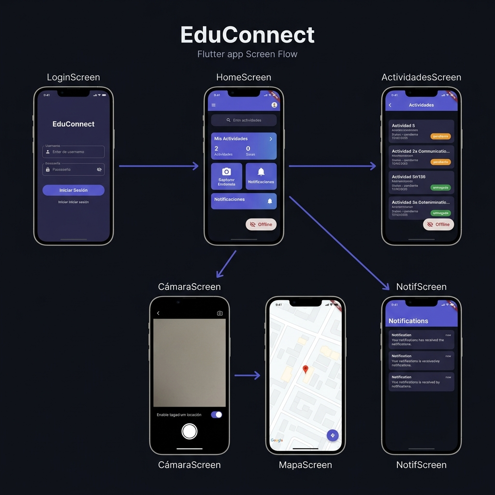

# Diseño Técnico de una Aplicación Móvil Multiplataforma para Institución Educativa

---

| Campo | Detalle |
|---|---|
| **Estudiante** | Carlos Andrés Ramirez Valencia |
| **Asignatura** | Lenguaje de Computación para Móviles |
| **Unidad** | Unidad 3 — Desarrollo web multiplataforma orientado a dispositivos móviles |
| **Fecha** | Junio 2026 |
| **Tipo de actividad** | Diseño técnico y sustentación |

---

## Tabla de Contenido

1. [Descripción del problema](#1-descripción-del-problema)
2. [Historias de usuario](#2-historias-de-usuario)
3. [Matriz comparativa de enfoques](#3-matriz-comparativa-de-enfoques)
4. [Selección tecnológica y justificación](#4-selección-tecnológica-y-justificación)
5. [Arquitectura mínima viable](#5-arquitectura-mínima-viable)
6. [Consideraciones móviles](#6-consideraciones-móviles)
7. [Riesgos y limitaciones](#7-riesgos-y-limitaciones)

---

## 1. Descripción del problema

### 1.1 Contexto

Una institución educativa enfrenta dificultades en la comunicación académica con sus estudiantes. Actualmente, la información sobre actividades, tareas y anuncios se distribuye por múltiples canales no centralizados (grupos de mensajería, correo electrónico, tableros físicos), lo que genera:

- Pérdida frecuente de mensajes o notificaciones importantes.
- Baja trazabilidad sobre qué actividades ha revisado o completado cada estudiante.
- Imposibilidad de acceder a la información cuando no hay conexión estable a internet.
- Ausencia de un mecanismo formal para registrar evidencias del cumplimiento de actividades.

La institución necesita una **aplicación móvil centralizada** que resuelva estos problemas de manera práctica, económica y sostenible.

### 1.2 Público objetivo

| Tipo de usuario | Descripción |
|---|---|
| **Estudiante** | Usuario principal. Consulta actividades, recibe notificaciones y sube evidencias fotográficas. |
| **Docente / Administrador** | Publica actividades y revisa las evidencias enviadas por los estudiantes. |

### 1.3 Escenarios principales de uso

1. **Consulta offline**: El estudiante accede desde su casa sin datos móviles y puede revisar actividades previamente sincronizadas.
2. **Registro de evidencia**: El estudiante toma una foto de su trabajo terminado desde la app y la sube al sistema junto con su ubicación.
3. **Recepción de notificaciones**: El estudiante recibe una alerta push cuando se publica una nueva actividad o un plazo está por vencer.
4. **Sincronización diferida**: La app detecta que no hay conexión, guarda la evidencia localmente en SQLite y la sincroniza automáticamente cuando se restaura la conexión.

---

## 2. Historias de usuario

Las siguientes historias de usuario están **priorizadas** de mayor a menor impacto para el usuario:

| # | Historia de usuario | Prioridad |
|---|---|---|
| HU-01 | Como **estudiante**, quiero **consultar mis actividades académicas pendientes**, para **organizar mi agenda y no perder ninguna entrega importante**. | 🔴 Alta |
| HU-02 | Como **estudiante**, quiero **acceder a mis actividades sin conexión a internet**, para **poder revisar la información aunque no tenga datos móviles o WiFi**. | 🔴 Alta |
| HU-03 | Como **estudiante**, quiero **tomar una fotografía como evidencia de mi actividad completada directamente desde la app**, para **registrar el cumplimiento sin salir de la aplicación**. | 🔴 Alta |
| HU-04 | Como **estudiante**, quiero **recibir una notificación cuando se publique una nueva actividad o cuando se acerque un plazo de entrega**, para **estar al día sin tener que revisar la app manualmente**. | 🟡 Media |
| HU-05 | Como **estudiante**, quiero **que mi evidencia fotográfica registre automáticamente mi ubicación geográfica**, para **validar el contexto y el lugar donde realicé la actividad**. | 🟡 Media |
| HU-06 | Como **estudiante**, quiero **que las evidencias que no pude subir por falta de conexión se sincronicen automáticamente cuando vuelva a tener internet**, para **no perder mis registros por problemas de conectividad**. | 🟡 Media |

---

## 3. Matriz comparativa de enfoques

**Tabla 1: Matriz comparativa de enfoques técnicos**

| Criterio | PWA | Híbrida (Capacitor/Cordova) | Nativa Android | Flutter (compilado a nativo) |
|---|---|---|---|---|
| **Costo de desarrollo** | Bajo — HTML/CSS/JS estándar | Bajo-Medio — un código base web + plugins nativos | Alto — requiere desarrollador Android especializado | Bajo-Medio — un código base para múltiples plataformas |
| **Reutilización de código** | Alta — solo tecnologías web | Alta — el mismo código web sirve para iOS y Android | Muy baja — código específico por plataforma | Muy alta — un único código base Dart para Android e iOS |
| **Acceso a cámara** | Limitado — depende del navegador; sin control avanzado | Bueno — a través de plugins como `@capacitor/camera` | Excelente — acceso directo a Camera2 API | Excelente — plugin `image_picker` con acceso nativo directo |
| **Acceso a GPS** | Limitado — solo con HTTPS y permisos del navegador | Bueno — plugin `@capacitor/geolocation` | Excelente — acceso directo a FusedLocationProvider | Excelente — plugin `geolocator` con acceso nativo |
| **Funcionamiento offline** | Limitado — Service Workers básicos, sin BD estructurada nativa | Bueno — puede usar SQLite mediante plugins | Excelente — acceso completo a Room/SQLite de Android | Excelente — `sqflite` proporciona SQLite nativo completo |
| **Rendimiento en gama media/baja** | Regular — depende del motor del navegador del dispositivo | Regular — hay overhead de la capa web | Excelente — código nativo sin capas intermedias | Excelente — compilado a código nativo ARM, motor Impeller |
| **Facilidad de mantenimiento** | Alta — tecnologías web ampliamente conocidas | Media — requiere gestionar plugins nativos y versiones | Baja — requiere especialistas Android para cada cambio | Alta — un solo código base, ecosistema maduro y activo |
| **Publicación e instalación** | Parcial — no se puede publicar en Play Store nativamente | Completa — genera APK/AAB para Google Play | Completa — APK/AAB nativo para Google Play | Completa — genera APK/AAB optimizados para Google Play |
| **Limitaciones principales** | No instalable via Play Store; acceso nativo muy restringido | Dependencia de plugins de terceros; rendimiento no óptimo | Alto costo de desarrollo y mantenimiento; sin multiplataforma | Tamaño de APK ligeramente mayor; curva de aprendizaje en Dart |
| **Decisión final** | ❌ Descartada | ⚠️ Viable pero no óptima | ❌ Costosa | ✅ **Seleccionada** |

---

## 4. Selección tecnológica y justificación

### 4.1 Enfoque seleccionado: Flutter (compilado a nativo)

**Framework:** Flutter 3.x con Dart  
**Target:** Android (APK/AAB para Google Play)

### 4.2 Justificación de la decisión

La selección de Flutter se fundamenta en los criterios definidos por el contexto del problema:

| Criterio | Análisis |
|---|---|
| **Bajo costo de desarrollo** | Flutter usa un único código base en Dart para generar apps Android nativas. Esto reduce el tiempo de desarrollo y los costos frente al desarrollo nativo puro. |
| **Rendimiento en dispositivos de gama media/baja** | Flutter compila directamente a código ARM nativo usando el motor gráfico Impeller. No necesita un puente JavaScript ni un WebView, lo que garantiza 60fps incluso en hardware limitado. |
| **Acceso a cámara y GPS** | Los plugins oficiales `image_picker` y `geolocator` ofrecen acceso nativo completo a la cámara y al GPS, sin las restricciones de PWA ni la dependencia de plugins de terceros de Capacitor. |
| **Soporte offline robusto** | El paquete `sqflite` proporciona una base de datos SQLite local completa. Las actividades se almacenan localmente y las evidencias se encolan hasta que haya conexión. |
| **Facilidad de mantenimiento** | Un solo repositorio, un solo lenguaje (Dart), y un ecosistema estable con soporte de Google a largo plazo. |
| **Publicación como app instalable** | Flutter genera archivos APK y AAB listos para publicar en Google Play, cumpliendo el requisito de la institución de tener una app instalable. |
| **Escalabilidad** | La misma app puede extenderse a iOS con mínimas modificaciones en el futuro. |

### 4.3 Paquetes principales seleccionados

| Paquete | Función |
|---|---|
| `sqflite` | Base de datos SQLite local para almacenamiento offline estructurado |
| `hive` | Almacenamiento clave-valor ligero para caché de sesión y configuración |
| `image_picker` | Acceso nativo a la cámara para captura de evidencias |
| `geolocator` | Obtención de coordenadas GPS al registrar una evidencia |
| `firebase_messaging` | Notificaciones push (FCM) para alertas de nuevas actividades |
| `flutter_secure_storage` | Almacenamiento seguro de tokens de autenticación |
| `http` / `dio` | Consumo de API REST del backend institucional |
| `connectivity_plus` | Detección de estado de red para lógica offline/online |
| `provider` | Gestión de estado reactivo de la aplicación |

---

## 5. Arquitectura mínima viable

### 5.1 Diagrama de arquitectura en capas



La arquitectura sigue un patrón en **capas desacopladas**, donde cada capa tiene una responsabilidad única y se comunica solo con la capa inmediatamente inferior:

### 5.2 Descripción de capas

#### Capa 1 — Interfaz de usuario (UI Layer)

Contiene todos los widgets y pantallas de Flutter. Cada pantalla corresponde a una funcionalidad principal:

| Pantalla | Responsabilidad |
|---|---|
| `LoginScreen` | Autenticación del estudiante con el sistema institucional |
| `HomeScreen` | Dashboard principal con acceso rápido a todas las funciones |
| `ActividadesScreen` | Listado de actividades académicas con estado (pendiente/entregado) |
| `DetalleActividadScreen` | Información detallada de una actividad específica |
| `CámaraScreen` | Captura de evidencia fotográfica con opción de geolocalización |
| `MapaScreen` | Visualización de la ubicación registrada en la evidencia |
| `NotificacionesScreen` | Historial de alertas y notificaciones recibidas |

#### Capa 2 — Lógica de aplicación (Application Layer)

Gestiona el estado y la lógica de negocio usando el patrón **Provider**:

- `AuthProvider` — gestiona sesión activa y tokens
- `ActividadesProvider` — orquesta la obtención y sincronización de actividades
- `EvidenciaProvider` — coordina captura de foto, geolocalización y cola de envío
- `ConectividadProvider` — monitorea el estado de red y dispara sincronizaciones

#### Capa 3 — Servicios (Service Layer)

Abstrae el acceso a recursos externos e internos:

- `ApiService` — realiza las peticiones HTTP a la API REST del backend
- `CameraService` — encapsula `image_picker` para captura de imágenes
- `LocationService` — encapsula `geolocator` para obtener coordenadas GPS
- `NotificationService` — configura y maneja notificaciones push via FCM
- `SyncService` — ejecuta la sincronización de evidencias pendientes cuando hay red

#### Capa 4 — Almacenamiento local (Data / Storage Layer)

Toda la persistencia offline de la aplicación:

| Mecanismo | Qué almacena |
|---|---|
| **SQLite** (`sqflite`) | Actividades académicas, evidencias pendientes de sincronizar, historial de notificaciones |
| **Hive** | Datos de sesión, caché de configuración, preferencias del usuario |
| **File Storage** | Archivos de imagen de las evidencias fotográficas |
| **FlutterSecureStorage** | Token JWT de autenticación de forma cifrada |

**Esquema SQLite principal:**

```sql
-- Tabla de actividades académicas
CREATE TABLE actividades (
  id          INTEGER PRIMARY KEY,
  titulo      TEXT    NOT NULL,
  descripcion TEXT,
  fecha_limite TEXT,
  estado      TEXT    DEFAULT 'pendiente',  -- pendiente | entregado
  sincronizado INTEGER DEFAULT 1
);

-- Tabla de evidencias registradas
CREATE TABLE evidencias (
  id             INTEGER PRIMARY KEY AUTOINCREMENT,
  actividad_id   INTEGER NOT NULL,
  ruta_imagen    TEXT    NOT NULL,
  latitud        REAL,
  longitud       REAL,
  fecha_registro TEXT    NOT NULL,
  sincronizado   INTEGER DEFAULT 0,  -- 0 = pendiente, 1 = enviada
  FOREIGN KEY (actividad_id) REFERENCES actividades(id)
);
```

#### Capa 5 — APIs externas y del dispositivo

| Recurso | Descripción |
|---|---|
| **API REST Backend** | Endpoint institucional para obtener actividades y enviar evidencias |
| **Android Camera2** | API nativa de cámara accedida a través de `image_picker` |
| **FusedLocationProvider** | API de GPS de Android accedida a través de `geolocator` |
| **Firebase Cloud Messaging** | Servicio de notificaciones push de Google |

### 5.3 Diagrama de pantallas y flujo de navegación



### 5.4 Flujo offline-first

```
App inicia
  │
  ├─ ¿Hay conexión? ──SÍ──→ Llama API REST → Actualiza SQLite → Muestra datos
  │
  └──────────────── NO ──→ Carga datos desde SQLite → Muestra datos (modo offline)

Usuario captura evidencia
  │
  ├─ ¿Hay conexión? ──SÍ──→ Sube evidencia al servidor → Marca sincronizado=1 en SQLite
  │
  └──────────────── NO ──→ Guarda imagen en FileStorage → Registra en SQLite (sincronizado=0)
                              │
                    Cuando regresa la conexión
                              │
                    SyncService detecta registros con sincronizado=0
                              │
                    Sube automáticamente → Actualiza SQLite → sincronizado=1
```

---

## 6. Consideraciones móviles

### 6.1 Conectividad limitada

- La app implementa una estrategia **offline-first**: todos los datos se cargan primero desde SQLite local y luego se actualizan desde la API cuando hay red.
- El paquete `connectivity_plus` monitorea permanentemente el estado de la red y activa el `SyncService` al detectar reconexión.
- Las operaciones críticas (ver actividades, registrar evidencias) funcionan completamente sin internet.

### 6.2 Bajo consumo de datos

- Las actividades se sincronizan solo cuando hay cambios (usando `ETag` o `Last-Modified` en las cabeceras HTTP).
- Las imágenes de evidencia se comprimen antes de subirse usando el parámetro de calidad de `image_picker` (`imageQuality: 70`).
- El caché local evita peticiones repetidas innecesarias.

### 6.3 Rendimiento en dispositivos modestos

- Flutter compila a código ARM nativo, eliminando la capa de WebView o JavaScript que degrada el rendimiento.
- Se evitan animaciones costosas y se usan widgets livianos (`ListView.builder` con lazy loading para listas de actividades).
- Las operaciones de base de datos SQLite se ejecutan en hilos de fondo usando `Isolate` para no bloquear la UI.

### 6.4 Experiencia de usuario en pantallas pequeñas

- Diseño responsivo usando `MediaQuery` y `LayoutBuilder` de Flutter.
- Tipografía mínima de 14sp para legibilidad en pantallas pequeñas.
- Componentes táctiles con área mínima de 48x48dp según las guías de Material Design.
- Indicador permanente de estado offline visible en el `HomeScreen`.

### 6.5 Permisos del dispositivo

| Permiso | Uso | Cuándo se solicita |
|---|---|---|
| `CAMERA` | Captura de evidencias fotográficas | Al acceder a `CámaraScreen` por primera vez |
| `ACCESS_FINE_LOCATION` | Geolocalización de evidencias | Al activar el toggle de ubicación en `CámaraScreen` |
| `POST_NOTIFICATIONS` (Android 13+) | Notificaciones push | Al iniciar sesión por primera vez |
| `READ/WRITE_EXTERNAL_STORAGE` | Guardar imágenes localmente | Al capturar la primera evidencia |

Los permisos se solicitan de forma contextual (en el momento en que el usuario los necesita), con una explicación clara del motivo.

### 6.6 Seguridad básica de los datos

- El token JWT de autenticación se almacena en `FlutterSecureStorage` (cifrado con Android Keystore).
- Las comunicaciones con el backend se realizan exclusivamente sobre **HTTPS**.
- Las imágenes de evidencia se guardan en el directorio privado de la app (`getApplicationDocumentsDirectory()`), inaccesible para otras apps.
- La sesión expira automáticamente y se requiere reautenticación al detectar token inválido.

---

## 7. Riesgos y limitaciones

**Tabla 2: Matriz de riesgos técnicos y mitigación**

| # | Riesgo | Impacto | Probabilidad | Estrategia de mitigación |
|---|---|---|---|---|
| R-01 | **Fallos de conexión a internet** durante el uso de la app | El estudiante no puede sincronizar actividades ni evidencias en tiempo real | Alta | Implementar estrategia offline-first con SQLite local. El `SyncService` realiza sincronización automática al recuperar la conexión. |
| R-02 | **Dispositivos Android con versiones antiguas** (API < 21) que no soporten todas las APIs usadas | La app no funcionaría correctamente en un porcentaje del parque de dispositivos de la institución | Media | Definir `minSdkVersion 21` (Android 5.0) como mínimo soportado, que cubre más del 99% de dispositivos activos. Realizar pruebas en emuladores de gama baja. |
| R-03 | **Denegación de permisos** de cámara o GPS por parte del estudiante | No se puede registrar evidencias fotográficas ni geolocalización | Media | Mostrar diálogos informativos que expliquen el propósito del permiso antes de solicitarlo. Si se deniega, permitir subir evidencias sin foto y sin ubicación como alternativa. |
| R-04 | **Tamaño del APK** mayor al esperado debido al runtime de Flutter | Dificultad para instalar en dispositivos con almacenamiento interno limitado | Baja | Usar `flutter build apk --split-per-abi` para generar APKs separados por arquitectura, reduciendo el tamaño de ~20MB a ~7MB por APK. |
| R-05 | **Inconsistencias en la sincronización** si el estudiante modifica datos offline y online simultáneamente | Conflictos de datos entre la base de datos local y el servidor | Baja | Implementar una estrategia de resolución de conflictos basada en `timestamp` de última modificación. El servidor siempre tiene prioridad sobre los datos locales. |

---

## 8. Video de sustentación

> 📹 **Enlace al video:** [Ver sustentación en Vimeo](https://vimeo.com/1199047756?share=copy&fl=sv&fe=ci)

**Puntos cubiertos en el video:**
1. El problema que busca resolver la aplicación
2. Las funcionalidades principales
3. El enfoque tecnológico seleccionado (Flutter) y su justificación
4. La arquitectura propuesta en capas
5. La decisión tecnológica fundamentada en los criterios del contexto

---

*Documento elaborado por Carlos Andrés Ramirez Valencia — Unidad 3, Lenguaje de Computación para Móviles — Junio 2026*
